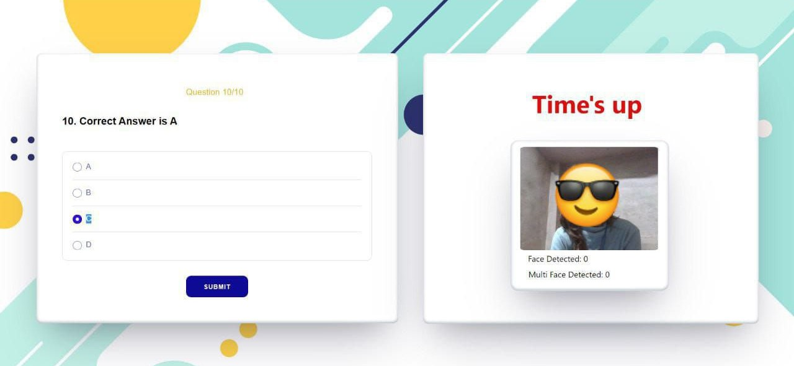
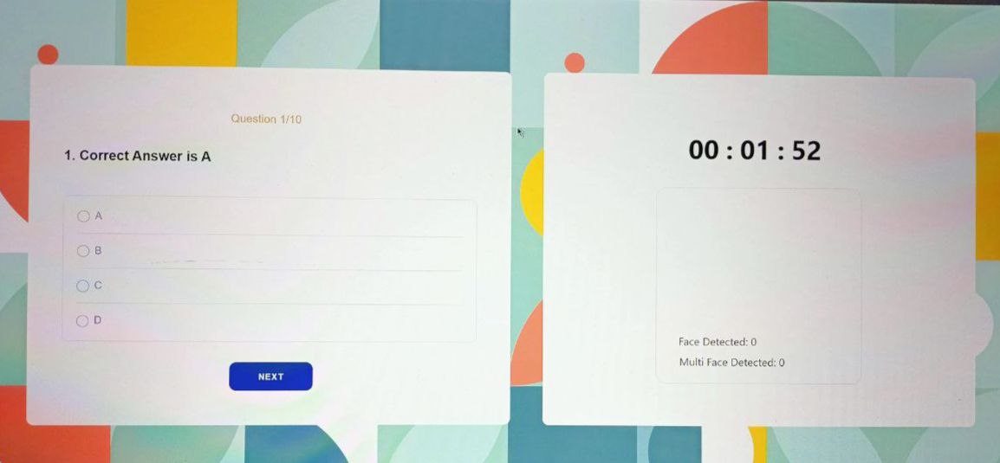

# Web-based Quiz Application with React and Firebase 

This is a web-based quiz application that is built with React as the frontend and Firebase as the database. It includes a face detection feature and a time-out session feature. 

## Features 

- Face detection feature: The application uses face detection to make sure that only one person is taking the quiz at a time. 
- Time-out feature: The Quiz will have a set of pre-determined questions, and users can select their answers by clicking on the corresponding radio buttons. Each quiz will also have a time limit, after which the quiz will automatically submit. 

## Firebase Configuration 
- Create a new Firebase project 
- Enable the Firestore Database 
- Add a new collection named "questions" 
- Add the following fields to the "questions" collection: 
question (string) 
options (array) 
answer (string) 
- Populate the "questions" collection with quiz questions and answers. 

## Result 
After completing the quiz, users can view their quiz results on the dashboard page. The results include the user's score, the number of correct and incorrect answers, and a detailed breakdown of each question and answer. 

## Technologies Used 
- React.js  
- Firebase Realtime Database  
- Firebase Authentication  
- Firebase Storage  
- Face API for face detection 

## Made by 
- [Mansi Prajapati] (prajapatimansi6024@gmail.com)